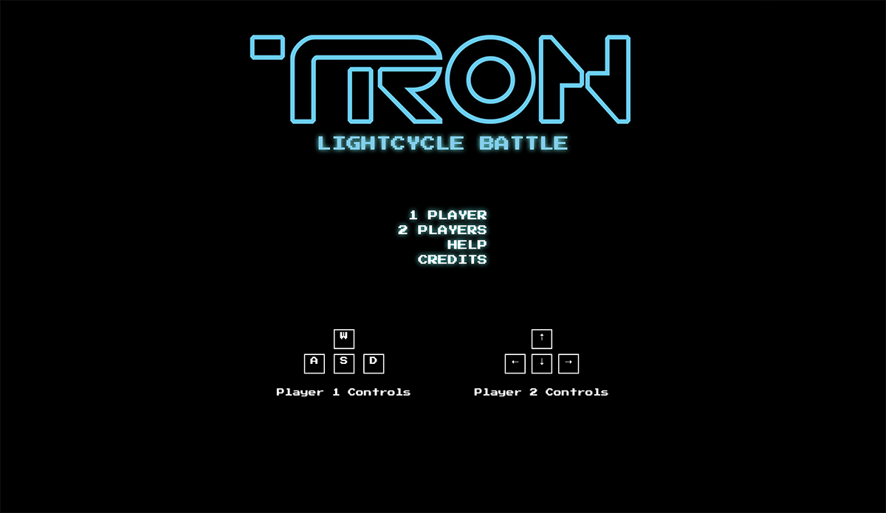

# TRON Lightcycle Battle
## App Demo
Link to GitHub project (https://vincelaq.github.io/tron-lightcycle-game/)

## Concept
### Gameplay
The game is a head-to-head version of classic game "Snake". Like the original version of the game, a player inputs a directional change, when needed, to a lead box that automatically moves and a "tail" follows. 

Unlike the original game where you collect "apples" and your snake's tail grows longer, Tron Lightcycle Battle does not have a tail, but any space that has been occupied by the player(s) in the past will be considered a wall to crash into for the entire round. This game also puts players against each other (or against a CPU) in a last-player-standing premise wins the game. 

Each player has five lives at the start of the game. When a player crashes into a wall (whether it be the wall of the game arena or a wall created by themselves or a wall created by the opponent) the player loses a life and the round ends. An "extra life" will have a 50% chance of appearing at the beginning of each round (in the appearance of a glowing box). This adds an extra life to the player that reaches it first. The game ends when a player loses all their lives.

### Design
Aside from the gameplay being based on the original "Snake" game, the design concept and visuals was straight from the Tron movies. The premise behind the movie is that the main character is sucked into a super computer where he has to play games to avoid getting deresolutioned ("derezzed") or, in other words, computer death (or in the main character's case, actual death). One of these games is a lightcycle game. Both Tron movies (Tron and Tron: Legacy) feature a lightcycle scene, where the lightcycle generates a wall in its trail for opponents to crash into.

## Wireframes:
### Original Concept
The images below show the original concept used in the project pitch. The design is very minimal and very few elements were used. The wireframe is similar to what ended up in the final layout.

## Technologies Used:
    - HTML
    - CSS
    - JavaScript
    - Google Fonts
    - jQuery

## Approach:
My approach to development was to have specific milestones that either meet Minimum Viable Product (MVP) requirements and/or get a proper working game running. Once all milestones were complete, I worked on improvements.

### Base Milestones:
  - Setup basic HTML page with necessary elements
  - Setup basic CSS stylesheet with all necessary styles
  - Setup javascript for:
      - Gameboard
          - Generate a grid in HTML page
          - Have a way to reference to each grid element from the javascript
      - Initial game states
  - Write code to get player to "move"
      - Fill up next square on the grid
      - Set "interval"
  - Write code for user input on directional changes
  - Write code for different ways for player death
  - Implement a second player
  - Develop code for CPU decision making
  - Develop a scoring system
  - Write code for win state

### Extra Milestones Achieved
  - Create CSS and Layouts that represent Tron-like designs
  - Create an "extra life" option
  - Create a pop-up overlay that notifies game states
  - Add more style for fun

### Extra Milestones Not Achieved
  - Create a player vs CPU level progression
      - Increase CPU AI
      - Increase number of CPU opponents
      - increase arena wall obstacles
          - "Islands" in the center of the map
  - Create a "boost" option
  - Create a wall "on" and "off"
  - Add music and sound effects

## Challenges:
Every challenge was solved by "googling"
  - Creating logic for box to "move" was very abstract because the box isn't actually moving. Overcame this by analyzing the "movement" step-by-step:
    1. Identify the different grid positions
    2. Identify player position with an index equal to the grid position
    3. State current player position by the first index in an array (new positions will be unshifted in)
    4. Change grid css of the player's current position
    5. Do steps 2-3 in a timed interval
  - Directional changes were a different type of logic on a grid. Overcame this by analyzing what I want the box to actually do and repeated trail and error process.
  - CPU AI was tough with mind-numbing if-statements. I tested in game if the CPU decision tree worked or not.
  - The CSS overlay replacing document alerts was challenging because I had never done anything like that from scratch. W3Schools has a overlay tutorial on how to do this.

## Additional information:
### Identified Bugs Still in Production
1. Players can cross eachother and game still continues - Game script allows this because at a specific moment the movement ahead is an empty square, by the time the CSS application and game check runs, another player has occupied it and running the same checks.
2. Frame rate lag - The game lags at certain times because of the numbe of functions, calculations and checks it has to do for each interval.
